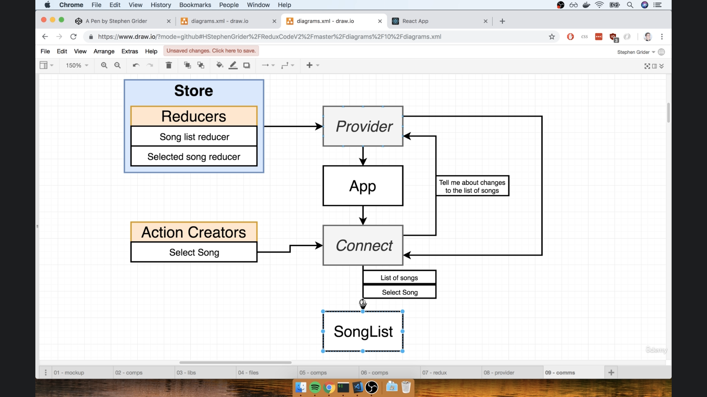

# 

## Action File

NOTES: in the action folder, you can create actions that will be used in the reducers

- side NOTE using webpack if we create a index.js in any file and then import the file without specifying the file name, it will automatically import the index.js file

---

| NOTE | NOTE Contact                                                                                                                                                                            |
| ---- | --------------------------------------------------------------------------------------------------------------------------------------------------------------------------------------- |
| 1-   | create fires action creator in action creator i have to add type but pay load is option is optional                                                                                     |
| 2-   | reducers dynamics reducer will get a action and property to reduce payload will be executed when the                                                                                    |
| 3-   | after that combined reducer function from redux will be use to compiled the reducers and imported to                                                                                    |
| 4-   | create and instants from provider component and wrap our App component and pass stor and props                                                                                          |
| 5-   | connect will communicate with App are provider and the provider will communicate with App                                                                                               |
| 6-   | state from are store step mapStateToProps or anything passed to connect function will connect the reducers keys to the state in the same functions that are passed to the function Name |

---

- side NOTE keys for state are the same keys passed to compendsReducers
